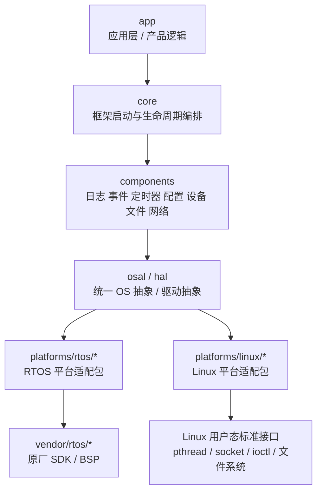

# embedded-platform-core

一个面向 RTOS 和 Linux 的可移植嵌入式平台框架，保留原厂 SDK，并提供统一的 OS、驱动和组件抽象层。  
English: A portable embedded platform framework for RTOS and Linux, with unified OS, driver, and component abstractions.

## 工程定位

`embedded-platform-core` 的目标不是替换原厂 SDK，也不是把所有平台细节揉成一套“万能大一统”实现，而是建立一层稳定的公共框架边界：

- RTOS 侧保留原厂 SDK、原厂启动链路和原厂 BSP
- Linux 侧走标准用户态接口，不引入“伪 vendor SDK”
- 应用层只面对统一接口，不直接碰平台差异
- 新平台接入时，尽量通过新增平台包完成，而不是修改上层业务代码

当前仓库还处在 **bootstrap / scaffold** 阶段，重点是把框架骨架、目录边界、公共头文件、平台包样板、测试框架和 GitHub 协作基础先立起来。

## 设计目标

- 支持 `RTOS` 和 `Linux` 两类平台
- 保留 RTOS 原厂 SDK，不重写底层启动模型
- 提供统一的 `OSAL` 和 `HAL` 公共接口
- 将平台差异收口到 `platforms/*`
- 让应用和公共组件层尽量不感知芯片、OS、原厂接口差异
- 为后续增加芯片、SoC、板级配置和产品功能保留清晰扩展路径

## 总体架构

框架当前采用分层组织：

`app -> core -> components -> osal/hal -> platforms/* -> vendor sdk 或 linux standard interfaces`

### 架构框图



### 启动路径

RTOS 侧：

```text
vendor startup / RTOS main
-> platforms/rtos/.../startup/app_start.c
-> ep_framework_start()
-> ep_platform_boot()
-> ep_framework_init()
-> app_main()
```

Linux 侧：

```text
platforms/linux/.../startup/main.c
-> ep_framework_start()
-> ep_platform_boot()
-> ep_framework_init()
-> app_main()
```

## 当前已落地内容

当前仓库已经完成了第一阶段骨架化工作：

- 顶层 CMake 构建入口
- `core/` 与 `app/` 的最小启动骨架
- `osal/` 公共头文件面
- `hal/` 公共头文件面
- `platforms/rtos/demo_family` 平台样板
- `platforms/linux/demo_family` 平台样板
- GitHub `PR / Issue / CI / CODEOWNERS` 基础设施
- 对应的 host-side / contract 测试骨架

## 目录结构

当前仓库主结构如下：

```text
embedded-platform-core/
├── .github/
├── app/
│   └── include/
├── cmake/
│   ├── modules/
│   ├── presets/
│   └── toolchains/
├── components/
│   ├── config/
│   ├── device/
│   ├── event/
│   ├── file/
│   ├── log/
│   ├── net/
│   └── timer/
├── config/
│   ├── common/
│   ├── feature/
│   └── profiles/
├── core/
│   ├── include/
│   └── src/
├── docs/
│   ├── architecture/
│   ├── decisions/
│   ├── porting/
│   ├── testing/
│   └── superpowers/
├── examples/
├── hal/
│   └── include/
├── osal/
│   └── include/
├── platforms/
│   ├── linux/
│   │   ├── common/
│   │   └── demo_family/
│   └── rtos/
│       ├── common/
│       └── demo_family/
├── tests/
│   ├── api_contract/
│   ├── host_unit/
│   ├── integration/
│   └── target_smoke/
├── third_party/
│   └── external/
├── tools/
│   ├── ci/
│   └── scripts/
└── vendor/
    └── rtos/
```

## 关键目录说明

### `app/`

应用入口和产品逻辑。

约束：

- 不直接包含原厂 SDK 头文件
- 不直接包含 Linux 平台原生头文件
- 不写平台相关 `#ifdef`

### `core/`

框架启动和生命周期编排。

当前关键接口：

- `ep_framework_init()`
- `ep_framework_start()`

### `components/`

跨平台公共组件层，目前先把结构搭出来，后续逐步接真实功能。

### `osal/`

公共 OS 抽象层，当前已建立以下头文件：

- `ep_osal_types.h`
- `ep_osal_err.h`
- `ep_osal_thread.h`
- `ep_osal_mutex.h`
- `ep_osal_sem.h`
- `ep_osal_queue.h`
- `ep_osal_time.h`
- `ep_osal_mem.h`

### `hal/`

公共硬件抽象层，当前已建立以下头文件：

- `ep_hal_types.h`
- `ep_hal_err.h`
- `ep_hal_gpio.h`
- `ep_hal_uart.h`
- `ep_hal_i2c.h`
- `ep_hal_spi.h`
- `ep_hal_pwm.h`
- `ep_hal_adc.h`

### `platforms/`

平台差异收口层。

当前样板包：

- `platforms/rtos/demo_family`
- `platforms/linux/demo_family`

每个平台包包含：

- `startup/`
- `osal_port/`
- `hal_port/`
- `component_port/`
- `board/`
- `config/`

### `vendor/`

RTOS 原厂 SDK 和补丁预留位置。

### `third_party/`

外部依赖预留位置，当前已有：

- `EasyLogger`
- `lvgl`

## 当前构建状态

当前骨架已经支持：

- 顶层 `cmake configure`
- `ep_core`
- `ep_app`
- `ep_osal`
- `ep_hal`
- `ep_platform_rtos_demo`
- `ep_platform_linux_demo`

说明：

- `ep_platform_linux_demo` 是可执行目标
- `ep_platform_rtos_demo` 当前是静态库骨架目标，用于平台样板和接口联通验证

## 当前测试覆盖

目前仓库中的测试主要覆盖“骨架正确性”和“公共头文件契约”：

- 仓库骨架目录存在性
- 顶层 CMake 构建骨架
- 框架启动骨架
- OSAL 公共头文件
- HAL 公共头文件
- RTOS / Linux 平台样板
- GitHub 工作流文件存在性

其中：

- OSAL / HAL 头文件测试已经强化到“可独立双重 include 并单独编译”的级别
- 平台样板测试已经覆盖 `cmake configure + build` smoke 流程

## GitHub 工作流

当前仓库已包含：

- `CODEOWNERS`
- Pull Request 模板
- Issue 模板
- GitHub Actions CI 骨架

当前 CI 运行：

```bash
pytest tests/host_unit tests/api_contract -v
```

## 当前约束

- 语言为标准 C
- Linux 仅做用户态框架
- RTOS 侧保留原厂 SDK / BSP / startup
- 当前仍是框架 bootstrap 阶段，不是完整产品级适配
- `demo_family` 只是占位平台包，后续要替换成真实平台

## 后续建议

下一阶段最实际的推进顺序：

1. 用真实平台名替换 `demo_family`
2. 接入真实 `board/config` 选择逻辑
3. 把 `OSAL` 和 `HAL` 从头文件骨架接到真实 backend
4. 增加更强的构建/链接/目标机 smoke 覆盖
5. 开始把业务模块接到统一接口层上

## 设计与计划文档

设计和实施计划保存在：

- `docs/superpowers/specs/`
- `docs/superpowers/plans/`

这些文档记录了当前仓库的架构思路、边界约束和骨架实现顺序。
